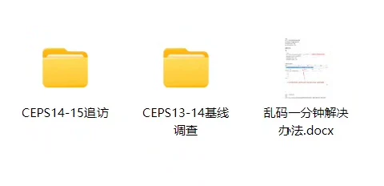
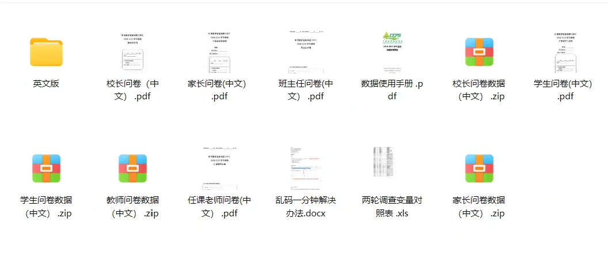
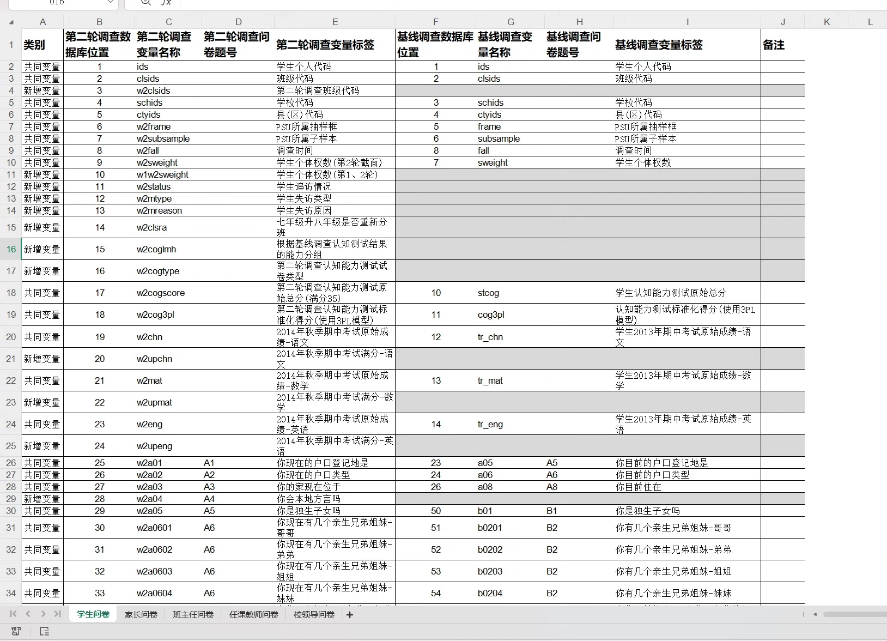

## Body

【2013-2015 Data Collection】China Education Monitoring Survey CEPS 2

013, 2014 Baseline Survey and Follow-up in 2014, 2015

The original data is in the states format, including a variable comparison table.
The data has been transcoded and organized for easy use.

## Images

Here is a pay link on Stripe ( https://buy.stripe.com/3cs8yP7sY87d0vu9AB ). Please contact me lonlonago@foxmail.com after funding $89, and I will send you a complete data files , thank you!

